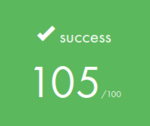
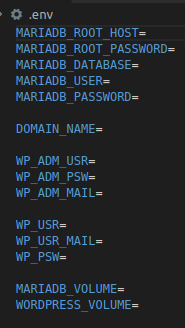
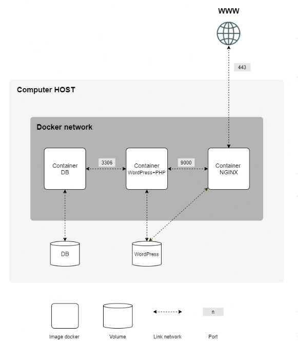

  
  

# Inception

## About

The goal of this project is to leverage Docker and docker-compose to create a comprehensive service that utilizes Nginx, Wordpress, and MariaDB. By running each service in its own container, we can ensure better isolation and easier management. Additionally, we will establish connections between the containers to facilitate communication and seamless functionality.

### Docker

Docker is a popular containerization platform that allows developers to easily package, distribute, and run applications in a portable and scalable manner. With Docker, you can create isolated environments, known as containers, that bundle together all the necessary dependencies and components required to run your application, including the operating system, libraries, and configuration files. This approach enables you to deploy your application across different environments, from development to production, without worrying about compatibility issues or installation procedures. Docker also provides a range of powerful tools and APIs for managing and orchestrating containers, allowing you to scale your application horizontally and vertically, automate deployments, and ensure high availability and resilience. Overall, Docker has become a game-changer for modern software development and deployment, making it easier, faster, and more reliable to build and run applications at scale.

### Docker compose

Docker Compose is a tool that simplifies the management and orchestration of multi-container Docker applications. It allows you to define and configure your application components, such as containers, networks, and volumes, using a simple YAML file. With Docker Compose, you can easily start, stop, and scale your application, as well as manage its dependencies and configurations.

## MariaDb

	MariaDB is a popular open-source relational database management system (RDBMS) that is designed to be a drop-in replacement for MySQL. It was created by the original developers of MySQL as a community-driven fork, after concerns arose over the acquisition of MySQL by Oracle Corporation. MariaDB retains much of the same syntax and structure as MySQL, but also includes several new features and improvements, such as better performance, enhanced security, and improved scalability.

	MariaDB supports a wide range of operating systems, including Linux, Windows, and macOS, and can be used with a variety of programming languages and frameworks. It also offers a range of tools and plugins for managing and monitoring your database, such as the MariaDB Connector/J for Java applications, the MariaDB MaxScale for database proxying and sharding, and the MariaDB ColumnStore for distributed analytics. Overall, MariaDB is a powerful and reliable choice for building scalable and high-performance database applications.

This container is focused solely on installing MariaDB from the Debian Booster image. In addition to the MariaDB installation, the container also includes a configuration file and a shell script that leverages environment variables to create a database instance exposed on port 3306. The configuration file enables you to customize the database settings, such as the database name, username, and password, while the shell script sets up the environment variables and starts the MariaDB server. Overall, this container provides a lightweight and efficient way to run a MariaDB database instance with a high degree of flexibility and ease of use.

## Wordpress

	WordPress is a popular open-source content management system (CMS) that allows users to create, manage, and publish content on the web. It was initially developed as a blogging platform, but has since evolved into a versatile CMS that can be used to create a wide range of websites, from simple blogs to complex e-commerce sites and social networks.

	WordPress is written in PHP and uses a MySQL or MariaDB database to store content and configuration data. It includes a user-friendly interface, a rich set of features and plugins, and a large community of developers and users who contribute to its development and support. Some of the key features of WordPress include a flexible and customizable template system, support for multimedia content such as images and videos, built-in SEO optimization tools, and a robust ecosystem of plugins and themes that enable users to extend and customize their sites in countless ways.

	Overall, WordPress is a powerful and user-friendly platform that has revolutionized the way websites are created and managed, making it accessible to users of all skill levels and backgrounds. It is estimated that WordPress powers over 40% of all websites on the internet, making it the most widely used CMS in the world.

This container utilizes a Debian Booster image to install PHP and WordPress, along with the WordPress command-line interface (WP-CLI) for easier management and automation. Additionally, the container includes a shell script that configures the WordPress installation and creates both admin and user accounts. The script uses various environment variables to set up the database connection, WordPress site name, admin credentials, and other settings, and exposes port 9000 to enable external access to the WordPress site.

By using this container, you can easily set up and manage a WordPress site without having to manually install and configure the software, which can save you time and effort. The container provides a streamlined and consistent environment for your WordPress site, making it easier to maintain and scale as your needs evolve. Overall, this container offers a powerful and convenient way to run and manage a WordPress site with minimal setup and configuration, while also providing external access to the site through port 9000.

## Nginx

	Nginx (pronounced "engine-x") is a popular open-source web server and reverse proxy server. It was initially developed to solve the "C10K problem", which refers to the challenge of handling a large number of concurrent connections efficiently. Nginx is designed to be lightweight, fast, and scalable, making it an ideal choice for high-traffic websites and web applications.

	Nginx can be used to serve static and dynamic content, including HTML files, images, videos, and web applications written in languages such as PHP, Python, and Node.js. It can also be used as a reverse proxy server, which enables it to distribute incoming requests to multiple backend servers based on various criteria, such as load balancing, caching, and SSL termination.

	Nginx includes a modular architecture that allows users to add or remove features as needed, making it highly customizable and flexible. It also includes a rich set of features, such as HTTP and HTTPS support, virtual hosting, URL rewriting, and authentication. Additionally, Nginx has a large and active community of developers and users who contribute to its development, support, and documentation.

	Overall, Nginx is a powerful and versatile web server that provides high performance, scalability, and flexibility, making it a popular choice for a wide range of websites and web applications.

### SSL  and TLS

	SSL (Secure Sockets Layer) and TLS (Transport Layer Security) are cryptographic protocols used to secure communication over the internet. SSL is the predecessor of TLS, but it is no longer used because it has known security vulnerabilities.

	TLS 1.3 is the latest version of the TLS protocol and is considered to be more secure and efficient than its predecessors. It includes several new features and improvements, such as faster handshakes, improved security algorithms, and simplified encryption modes.

	TLS 1.3 provides end-to-end encryption for data in transit between a client and a server. This means that any data transmitted between the client and server is encrypted and cannot be read by third parties, even if it is intercepted. TLS 1.3 achieves this by using various cryptographic algorithms, such as elliptic curve cryptography and authenticated encryption.

	In addition to providing security for data in transit, TLS 1.3 also includes various security mechanisms to protect against attacks, such as downgrade attacks, replay attacks, and man-in-the-middle attacks. It also includes mechanisms to ensure the authenticity of the server and the client, such as certificate validation and client authentication.

	Overall, TLS 1.3 provides a high level of security for internet communication and is widely used by websites and web applications to protect sensitive data, such as passwords, credit card information, and personal information.

### HTTP x HTTPS
	
	HTTP (Hypertext Transfer Protocol) and HTTPS (HTTP Secure) are both protocols used for transmitting data over the internet. The main difference between them is that HTTPS is a secure version of HTTP, which means that it provides additional security features to protect data in transit.
	
	HTTP is a plain-text protocol, which means that the data transmitted between the client and server is sent in an unencrypted format. This makes it vulnerable to interception and snooping by third parties. HTTP is used for transmitting non-sensitive data, such as publicly accessible websites and information.
	
	HTTPS, on the other hand, is a secure version of HTTP that uses encryption to protect the data in transit. HTTPS encrypts the data using SSL/TLS protocols, which provide end-to-end encryption between the client and the server. This means that any data transmitted between the client and the server is encrypted and cannot be read by third parties, even if it is intercepted.
	
	HTTPS provides several additional security features over HTTP, such as data integrity, authentication, and encryption. HTTPS is commonly used for transmitting sensitive data, such as online transactions, login credentials, and personal information.
	
	Overall, the main difference between HTTP and HTTPS is that HTTPS provides additional security features to protect data in transit, making it more secure than HTTP. When transmitting sensitive data, it is recommended to use HTTPS to ensure the privacy and security of the data.
	
The container uses a Debian Buster image to install Nginx, which is used to manage the services for WordPress and MariaDB. Nginx is configured to use port 443 and SSL/TLS 1.3 encryption to secure all connections to the services.

## Redis

	Redis is an open-source, in-memory data structure store that is used as a database, cache, and message broker. It is known for its performance and scalability, making it a popular choice for building fast and efficient web applications.

	Redis supports a variety of data structures, including strings, hashes, lists, sets, and sorted sets. It also provides advanced features such as transactions, Lua scripting, and pub/sub messaging, which make it a versatile tool for a wide range of use cases.

	One of the key benefits of Redis is its speed. Since it stores data in memory, it can provide extremely fast read and write operations, making it ideal for use cases that require high throughput and low latency. It also supports data persistence, allowing data to be stored to disk and retrieved after a restart.

	Redis can be used in a variety of applications, including caching, real-time analytics, messaging, and session management. It is widely used by companies such as Twitter, GitHub, and Craigslist, and has a large and active open-source community.

To improve the performance of the web page, a Redis container has been added. Redis is an in-memory data structure store that provides fast read and write operations, making it an ideal solution for caching frequently accessed data. By using Redis to cache frequently accessed data, the page can be served faster and with lower latency, improving the overall user experience.

## Other

The containers share two volumes, one for the database and the other for WordPress. The web page can be accessed through the address 42login.42.fr.

All the containers are managed by a Docker Compose file, and there is a Makefile to call all the necessary instructions as needed.

In addition, a .env file must be created in the same path as the docker-compose.yml file. This .env file should contain the following variables, which are necessary for the proper functioning of the containers:

-	DB_ROOT_PASSWORD: the root password for the MariaDB database
-	DB_NAME: the name of the database used by WordPress
-	DB_USER: the username used to access the database
-	DB_PASSWORD: the password used to access the database
-	WORDPRESS_DB_HOST: the host name for the MariaDB database
-	WORDPRESS_DB_NAME: the name of the database used by WordPress
-	WORDPRESS_DB_USER: the username used to access the database
-	WORDPRESS_DB_PASSWORD: the password used to access the database

These variables will be used by the containers to set up the necessary configurations and ensure that the services are properly connected.

    

## Diagram

        

## Dependencies

<a href="https://mariadb.org/">MariaDb</a> 
<a href="https://wordpress.com/">Wordpress</a> 
<a href="https://www.nginx.com/">Nginx</a> 
<a href="https://www.docker.com/">Docker</a> 
<a href="https://docs.docker.com/compose/">Docker compose</a> 

## References

<a href="https://www.youtube.com/watch?v=3c-iBn73dDE">TechWorld with Nana</a> 
<a href="https://www.youtube.com/watch?v=7VAI73roXaY">The NGINX Crash Course</a> 
<a href="https://www.linuxbabe.com/ubuntu/install-lemp-stack-ubuntu-20-04-server-desktop">How to Install LEMP Stack on Ubuntu 20.04 Server/Desktop - LinuxBabe</a> 
<a href="https://developer.wordpress.org/cli/commands/user/create/">wp user create | WP-CLI Command | WordPress Developer Resources</a> 

